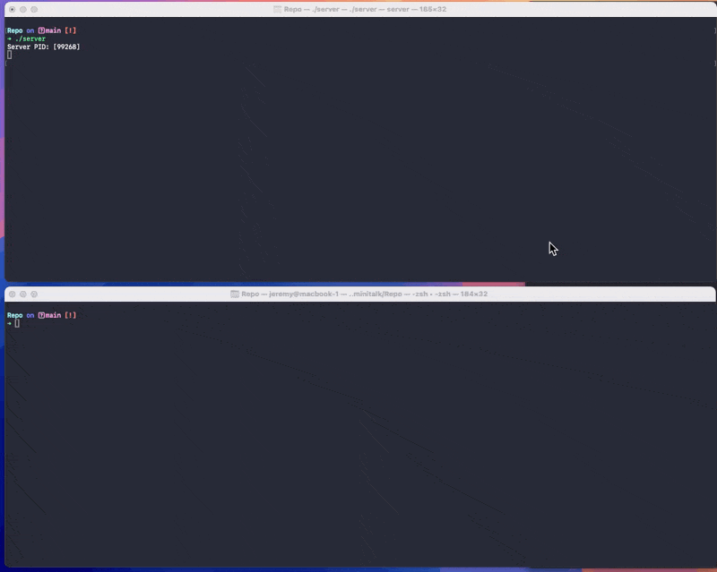

# Minitalk

## Projet

Minitalk is a project that demonstrates inter-process communication using UNIX signals. The goal is to create two programs: a server and a client, where the client sends a string message to the server, character by character, using the signals SIGUSR1 and SIGUSR2.

## Preview

## License

MIT License
Copyright (c) 2024 Jérémy Lorette% # Minitalk